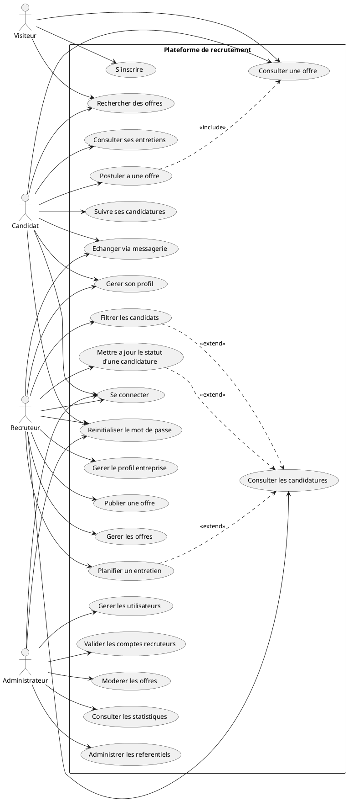

# Conception du diagramme de cas d'utilisation global

## 1. Objectif du document

Ce document presente la conception du diagramme de cas d'utilisation global de la plateforme de recrutement. Il permet d'identifier les acteurs principaux du systeme ainsi que les interactions essentielles qu'ils entretiennent avec la plateforme.

Le diagramme global sert a donner une vue d'ensemble du fonctionnement du systeme avant la conception detaillee des diagrammes par acteur ou par module.

## 2. Acteurs du systeme

Les acteurs retenus pour le diagramme global sont :

- `Visiteur` : utilisateur non authentifie qui consulte les offres et peut creer un compte.
- `Candidat` : utilisateur qui recherche des offres, postule et suit ses candidatures.
- `Recruteur` : utilisateur qui publie des offres, consulte les candidatures et gere le recrutement.
- `Administrateur` : utilisateur charge de gerer la plateforme, les utilisateurs, la moderation et les statistiques.

## 3. Cas d'utilisation principaux

### 3.1 Cas d'utilisation du Visiteur

- s'inscrire ;
- rechercher des offres ;
- consulter une offre.

### 3.2 Cas d'utilisation du Candidat

- se connecter ;
- reinitialiser le mot de passe ;
- gerer son profil ;
- rechercher des offres ;
- consulter une offre ;
- postuler a une offre ;
- suivre ses candidatures ;
- echanger via messagerie ;
- consulter ses entretiens.

### 3.3 Cas d'utilisation du Recruteur

- se connecter ;
- reinitialiser le mot de passe ;
- gerer son profil ;
- gerer le profil entreprise ;
- publier une offre ;
- gerer les offres ;
- consulter les candidatures ;
- filtrer les candidats ;
- mettre a jour le statut d'une candidature ;
- planifier un entretien ;
- echanger via messagerie.

### 3.4 Cas d'utilisation de l'Administrateur

- se connecter ;
- reinitialiser le mot de passe ;
- gerer les utilisateurs ;
- valider les comptes recruteurs ;
- moderer les offres ;
- consulter les statistiques ;
- administrer les referentiels.

## 4. Relations entre cas d'utilisation

Les relations principales retenues dans le diagramme global sont :

- `Postuler a une offre` inclut `Consulter une offre`, car la candidature se fait a partir d'une offre consultee.
- `Filtrer les candidats` etend `Consulter les candidatures`, car le filtrage est une action complementaire au traitement des candidatures.
- `Mettre a jour le statut d'une candidature` etend `Consulter les candidatures`, car cette action intervient pendant l'analyse des dossiers.
- `Planifier un entretien` etend `Consulter les candidatures`, car cette action se produit apres l'etude d'un candidat.

## 5. Diagramme global en PlantUML

Le code suivant permet de generer le diagramme de cas d'utilisation global :

## 6. Lecture du diagramme

Ce diagramme met en evidence que :

- le `Visiteur` intervient surtout en amont, avant authentification ;
- le `Candidat` est centre sur la recherche, la candidature et le suivi ;
- le `Recruteur` est centre sur la gestion des offres et des candidatures ;
- l'`Administrateur` intervient sur le controle, la supervision et le pilotage global ;
- la consultation des candidatures constitue un point central du processus recruteur.

## 7. Conclusion

Le diagramme de cas d'utilisation global fournit une vue synthetique du fonctionnement general de la plateforme de recrutement. Il constitue une base solide pour la suite de la conception, notamment pour :

- les diagrammes de cas d'utilisation detailles par acteur ;
- le diagramme de classes ;
- la conception de la base de donnees ;
- l'organisation des modules frontend et backend.
