# Elaboration du diagramme de classes de conception detaillee

## 1. Objectif du document

Ce document presente le diagramme de classes de conception detaillee de la plateforme de recrutement. Il vise a structurer les principales classes du systeme, leurs attributs, leurs operations, ainsi que les relations entre elles.

Contrairement au diagramme de classes purement metier, ce diagramme de conception detaillee prepare plus directement l'implementation. Il integre donc :

- les entites principales du domaine ;
- les enumerations utiles ;
- les relations avec multiplicites ;
- quelques services applicatifs relies aux traitements critiques.

## 2. Principes de conception retenus

La conception detaillee repose sur les choix suivants :

- une classe abstraite `Utilisateur` commune aux differents profils ;
- une specialisation des roles en `Candidat`, `Recruteur` et `Administrateur` ;
- une separation entre les entites metier et les services applicatifs ;
- une modelisation explicite des objets centraux du recrutement : `OffreEmploi`, `Candidature`, `Entretien`, `Conversation`, `Notification` ;
- une prise en compte des besoins de moderation, de suivi et de tracabilite.

## 3. Vue d'ensemble des classes principales

### 3.1 Classes utilisateurs

- `Utilisateur` : classe de base commune a tous les comptes.
- `Candidat` : gere le profil professionnel, les CV, les candidatures et les documents.
- `Recruteur` : gere l'entreprise, les offres et le suivi des candidatures.
- `Administrateur` : gere la supervision, la moderation et le pilotage global.

### 3.2 Classes metier

- `Entreprise` : represente l'entite recruteuse.
- `OffreEmploi` : represente une offre publiee sur la plateforme.
- `Candidature` : represente une postulation d'un candidat a une offre.
- `Entretien` : represente un rendez-vous planifie dans le cadre d'une candidature.
- `Conversation` et `Message` : representent la messagerie interne.
- `Notification` : represente les alertes envoyees aux utilisateurs.
- `JournalAction` : represente la tracabilite des actions sensibles.

### 3.3 Classes du profil candidat

- `CV` ;
- `Document` ;
- `Competence` ;
- `Experience` ;
- `Formation`.

### 3.4 Classes de referentiel

- `Secteur` ;
- `CompetenceRequise`.

### 3.5 Services applicatifs

- `AuthService` ;
- `OffreService` ;
- `CandidatureService` ;
- `EntretienService` ;
- `MessagerieService` ;
- `AdminService` ;
- `NotificationService`.

## 4. Diagramme de classes detaille en PlantUML

```plantuml
@startuml
skinparam classAttributeIconSize 0
skinparam packageStyle rectangle
hide empty members

package "Utilisateurs" {
  abstract class Utilisateur <<entity>> {
    - id: UUID
    - nom: String
    - prenom: String
    - email: String
    - telephone: String
    - motDePasseHash: String
    - photoUrl: String
    - role: Role
    - statutCompte: StatutCompte
    - dateCreation: DateTime
    - derniereConnexion: DateTime
    + modifierProfil(): void
    + changerMotDePasse(): void
    + desactiverCompte(): void
  }

  class Candidat <<entity>> {
    - titreProfil: String
    - resumeProfessionnel: Text
    - localisation: String
    - disponibilite: String
    - pretentionSalariale: Decimal
    + completerProfil(): void
    + televerserCV(): void
    + postuler(): void
  }

  class Recruteur <<entity>> {
    - fonction: String
    - estValide: Boolean
    + publierOffre(): void
    + gererCandidatures(): void
    + planifierEntretien(): void
  }

  class Administrateur <<entity>> {
    - niveauAcces: Integer
    + validerCompteRecruteur(): void
    + modererOffre(): void
    + consulterStatistiques(): void
  }
}

package "Profil candidat" {
  class CV <<entity>> {
    - id: UUID
    - titre: String
    - fichierUrl: String
    - version: Integer
    - dateDepot: DateTime
    - estPrincipal: Boolean
    + definirPrincipal(): void
  }

  class Document <<entity>> {
    - id: UUID
    - nomFichier: String
    - typeDocument: TypeDocument
    - urlFichier: String
    - dateDepot: DateTime
    + televerser(): void
    + supprimer(): void
  }

  class Competence <<entity>> {
    - id: UUID
    - libelle: String
    - niveau: String
    - anneesExperience: Integer
  }

  class Experience <<entity>> {
    - id: UUID
    - poste: String
    - entreprise: String
    - dateDebut: Date
    - dateFin: Date
    - description: Text
  }

  class Formation <<entity>> {
    - id: UUID
    - diplome: String
    - etablissement: String
    - dateDebut: Date
    - dateFin: Date
    - description: Text
  }
}

package "Recrutement" {
  class Entreprise <<entity>> {
    - id: UUID
    - raisonSociale: String
    - description: Text
    - taille: String
    - siteWeb: String
    - adresse: String
    - logoUrl: String
    - statutValidation: StatutValidationEntreprise
    + mettreAJourProfil(): void
    + soumettreValidation(): void
  }

  class Secteur <<entity>> {
    - id: UUID
    - nom: String
    - description: String
  }

  class OffreEmploi <<entity>> {
    - id: UUID
    - titre: String
    - description: Text
    - profilRecherche: Text
    - localisation: String
    - salaireMin: Decimal
    - salaireMax: Decimal
    - typeContrat: TypeContrat
    - niveauExperienceRequis: String
    - datePublication: DateTime
    - dateExpiration: DateTime
    - statut: StatutOffre
    + publier(): void
    + modifier(): void
    + archiver(): void
    + expirer(): void
  }

  class CompetenceRequise <<entity>> {
    - id: UUID
    - libelle: String
    - niveauMinimum: String
    - obligatoire: Boolean
  }

  class Candidature <<entity>> {
    - id: UUID
    - dateSoumission: DateTime
    - statut: StatutCandidature
    - commentaireCandidat: Text
    - scoreMatching: Decimal
    - dateDerniereMiseAJour: DateTime
    + soumettre(): void
    + changerStatut(): void
    + ajouterDocument(): void
  }

  class HistoriqueCandidature <<entity>> {
    - id: UUID
    - ancienStatut: StatutCandidature
    - nouveauStatut: StatutCandidature
    - dateChangement: DateTime
    - commentaire: String
  }

  class Entretien <<entity>> {
    - id: UUID
    - dateHeure: DateTime
    - mode: ModeEntretien
    - lieu: String
    - lienVisio: String
    - statut: StatutEntretien
    - compteRendu: Text
    + planifier(): void
    + reprogrammer(): void
    + annuler(): void
    + cloturer(): void
  }
}

package "Communication et suivi" {
  class Conversation <<entity>> {
    - id: UUID
    - dateCreation: DateTime
    - estActive: Boolean
    + ouvrir(): void
    + cloturer(): void
  }

  class Message <<entity>> {
    - id: UUID
    - contenu: Text
    - dateEnvoi: DateTime
    - lu: Boolean
    + envoyer(): void
    + marquerCommeLu(): void
  }

  class Notification <<entity>> {
    - id: UUID
    - titre: String
    - contenu: String
    - typeNotification: TypeNotification
    - lue: Boolean
    - dateEnvoi: DateTime
    + envoyer(): void
    + marquerCommeLue(): void
  }

  class JournalAction <<entity>> {
    - id: UUID
    - action: String
    - dateAction: DateTime
    - adresseIP: String
    - details: Text
  }
}

package "Services applicatifs" {
  class AuthService <<service>> {
    + inscrireCandidat(): Candidat
    + inscrireRecruteur(): Recruteur
    + authentifier(email, motDePasse): Utilisateur
    + reinitialiserMotDePasse(email): void
  }

  class OffreService <<service>> {
    + creerOffre(): OffreEmploi
    + modifierOffre(): OffreEmploi
    + publierOffre(): OffreEmploi
    + archiverOffre(): void
    + rechercherOffres(): List<OffreEmploi>
  }

  class CandidatureService <<service>> {
    + soumettreCandidature(): Candidature
    + verifierDoublon(): Boolean
    + changerStatut(): void
    + listerParOffre(): List<Candidature>
  }

  class EntretienService <<service>> {
    + planifierEntretien(): Entretien
    + annulerEntretien(): void
    + envoyerConvocation(): void
  }

  class MessagerieService <<service>> {
    + ouvrirConversation(): Conversation
    + envoyerMessage(): Message
  }

  class AdminService <<service>> {
    + validerCompteRecruteur(): void
    + modererOffre(): void
    + gererUtilisateurs(): void
    + consulterJournal(): List<JournalAction>
  }

  class NotificationService <<service>> {
    + notifierCandidature(): void
    + notifierEntretien(): void
    + notifierValidationCompte(): void
  }
}

enum Role {
  CANDIDAT
  RECRUTEUR
  ADMINISTRATEUR
}

enum StatutCompte {
  ACTIF
  EN_ATTENTE
  SUSPENDU
  DESACTIVE
}

enum StatutValidationEntreprise {
  EN_ATTENTE
  VALIDEE
  REJETEE
}

enum TypeDocument {
  CV
  LETTRE_MOTIVATION
  DIPLOME
  CERTIFICAT
  AUTRE
}

enum TypeContrat {
  CDI
  CDD
  STAGE
  ALTERNANCE
  FREELANCE
}

enum StatutOffre {
  BROUILLON
  EN_ATTENTE
  PUBLIEE
  ARCHIVEE
  EXPIREE
}

enum StatutCandidature {
  ENVOYEE
  EN_COURS
  RETENUE
  REJETEE
  ENTRETIEN_PLANIFIE
}

enum ModeEntretien {
  PRESENTIEL
  DISTANCIEL
  TELEPHONE
}

enum StatutEntretien {
  PLANIFIE
  REPORTE
  ANNULE
  TERMINE
}

enum TypeNotification {
  SYSTEME
  CANDIDATURE
  ENTRETIEN
  MESSAGE
}

Utilisateur <|-- Candidat
Utilisateur <|-- Recruteur
Utilisateur <|-- Administrateur

Entreprise "1" --> "1" Secteur
Entreprise "1" o-- "0..*" Recruteur
Entreprise "1" o-- "0..*" OffreEmploi

Candidat "1" o-- "0..*" CV
Candidat "1" o-- "0..*" Document
Candidat "1" o-- "0..*" Competence
Candidat "1" o-- "0..*" Experience
Candidat "1" o-- "0..*" Formation
Candidat "1" -- "0..*" Candidature

Recruteur "1" -- "0..*" OffreEmploi : publie
Recruteur "1" -- "0..*" Entretien : planifie

OffreEmploi "1" --> "1" Secteur
OffreEmploi "1" o-- "0..*" CompetenceRequise
OffreEmploi "1" -- "0..*" Candidature

Candidature "1" -- "1" OffreEmploi
Candidature "1" -- "1" Candidat
Candidature "1" o-- "0..*" HistoriqueCandidature
Candidature "1" -- "0..*" Entretien
Candidature "0..*" -- "0..*" Document : utilise

Conversation "1" o-- "0..*" Message
Conversation "0..1" --> "1" Candidature : concerne
Candidat "1" -- "0..*" Conversation
Recruteur "1" -- "0..*" Conversation
Message "1" --> "1" Utilisateur : expediteur

Utilisateur "1" -- "0..*" Notification
Utilisateur "1" -- "0..*" JournalAction : effectue

AuthService ..> Utilisateur
AuthService ..> Candidat
AuthService ..> Recruteur
OffreService ..> OffreEmploi
OffreService ..> Entreprise
CandidatureService ..> Candidature
CandidatureService ..> OffreEmploi
CandidatureService ..> Candidat
EntretienService ..> Entretien
MessagerieService ..> Conversation
MessagerieService ..> Message
AdminService ..> Utilisateur
AdminService ..> OffreEmploi
AdminService ..> JournalAction
NotificationService ..> Notification
NotificationService ..> Utilisateur

note bottom of Candidature
  Regle cle :
  un candidat ne peut pas
  postuler deux fois a la
  meme offre.
end note

@enduml
```

## 5. Lecture du diagramme

Le diagramme montre une architecture de conception organisee autour de quatre noyaux :

- le noyau `utilisateurs`, qui porte l'authentification, les roles et les droits ;
- le noyau `profil candidat`, qui regroupe les informations professionnelles exploitees lors d'une candidature ;
- le noyau `recrutement`, qui gere les offres, les candidatures, les entretiens et leur cycle de vie ;
- le noyau `communication et suivi`, qui prend en charge la messagerie, les notifications et la tracabilite.

Les services applicatifs jouent un role d'orchestration. Ils portent la logique de traitement sans surcharger les entites metier.

## 6. Relations importantes a retenir

- `Utilisateur` est la super-classe de `Candidat`, `Recruteur` et `Administrateur`.
- Un `Recruteur` appartient a une `Entreprise`.
- Une `Entreprise` publie plusieurs `OffreEmploi`.
- Un `Candidat` peut posseder plusieurs `CV`, `Document`, `Competence`, `Experience` et `Formation`.
- Une `Candidature` relie un `Candidat` a une `OffreEmploi`.
- Une `Candidature` peut contenir plusieurs changements d'etat via `HistoriqueCandidature`.
- Une `Candidature` peut donner lieu a zero, un ou plusieurs `Entretien`.
- Une `Conversation` peut etre reliee a une `Candidature` et contient plusieurs `Message`.
- Chaque `Utilisateur` peut recevoir des `Notification` et generer des `JournalAction`.

## 7. Interet de cette conception detaillee

Ce diagramme peut servir de base pour :

- la conception de la base de donnees relationnelle ;
- la creation des entites backend ;
- la definition des DTO et des API ;
- la separation des services metier ;
- la preparation des diagrammes de sequence ;
- la redaction des cas de test techniques et fonctionnels.

## 8. Conclusion

Le diagramme de classes de conception detaillee propose une structure coherente avec les besoins fonctionnels deja identifies dans le projet. Il couvre les mecanismes essentiels de la plateforme de recrutement :

- gestion des comptes ;
- gestion des profils ;
- publication des offres ;
- depot et suivi des candidatures ;
- organisation des entretiens ;
- communication interne ;
- administration et tracabilite.

Il constitue une base suffisamment detaillee pour passer a l'etape suivante de conception technique ou de modelisation de la base de donnees.
