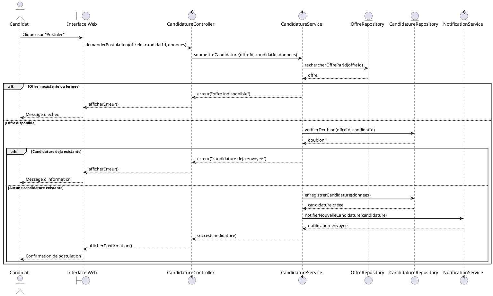
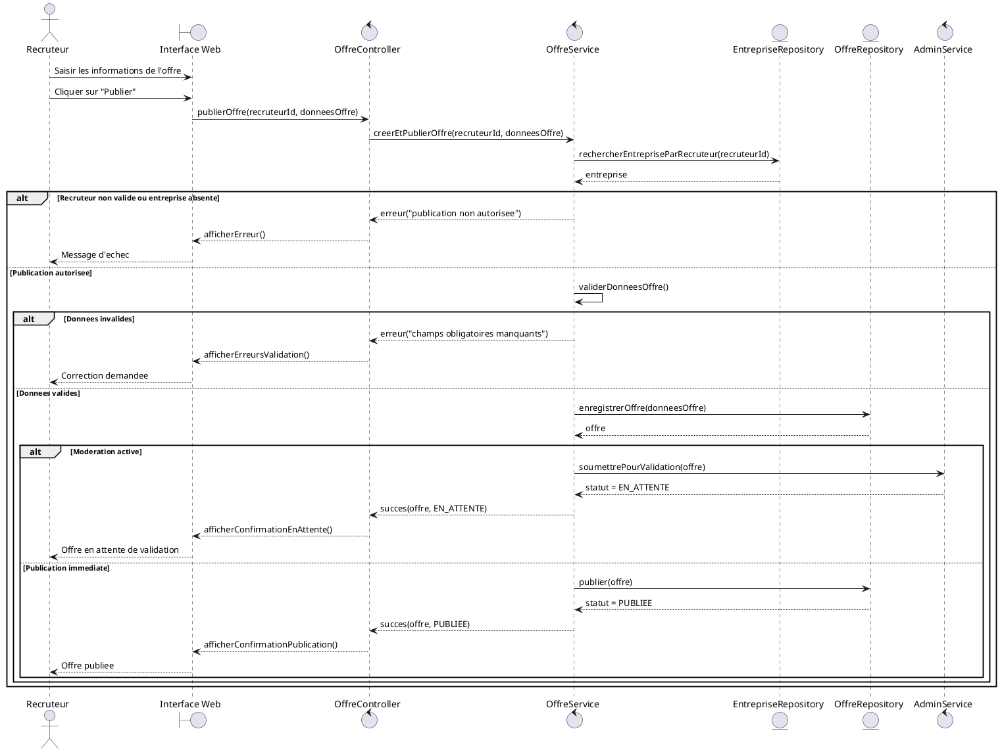

# Conception des diagrammes de sequence

## 1. Objectif du document

Ce document presente la conception des diagrammes de sequence de la plateforme de recrutement. Les diagrammes de sequence permettent de decrire, dans l'ordre chronologique, les interactions entre les acteurs et les composants du systeme pour realiser un scenario donne.

Dans le cadre de ce projet, les diagrammes de sequence sont construits a partir des cas d'utilisation critiques deja identifies :

- `Postulation a une offre` ;
- `Publication d'une offre`.

## 2. Role des diagrammes de sequence

Les diagrammes de sequence servent a :

- decrire le deroulement detaille d'un traitement ;
- identifier les objets qui interagissent ;
- preciser l'ordre des messages echanges ;
- mieux preparer l'implementation backend et frontend ;
- verifier la coherence entre les besoins fonctionnels et la conception technique.

## 3. Diagramme de sequence n°1 : Postulation a une offre

### 3.1 Description du scenario

Ce diagramme decrit le processus par lequel un candidat authentifie consulte une offre puis soumet sa candidature. Il integre les controles principaux :

- verification de l'authentification ;
- verification de la disponibilite de l'offre ;
- verification de l'absence de doublon ;
- enregistrement de la candidature ;
- notification du recruteur.

### 3.2 Participants

- `Candidat`
- `Interface Web`
- `CandidatureController`
- `CandidatureService`
- `OffreRepository`
- `CandidatureRepository`
- `NotificationService`

### 3.3 Diagramme en PlantUML

### 3.4 Lecture du diagramme

Le candidat declenche l'action depuis l'interface. Le controle est ensuite confie au `CandidatureController`, qui transmet le traitement au `CandidatureService`.

Le service verifie d'abord l'existence et la disponibilite de l'offre. Si l'offre est valide, il controle ensuite qu'aucune candidature precedente n'existe pour le meme candidat et la meme offre. En cas de succes, la candidature est enregistree puis une notification est envoyee.

## 4. Diagramme de sequence n°2 : Publication d'une offre

### 4.1 Description du scenario

Ce diagramme decrit le processus par lequel un recruteur authentifie cree puis publie une offre d'emploi. Il tient compte :

- de la verification des droits du recruteur ;
- de la validation des donnees obligatoires ;
- de l'enregistrement de l'offre ;
- de la mise en statut `publiee` ou `en attente`.

### 4.2 Participants

- `Recruteur`
- `Interface Web`
- `OffreController`
- `OffreService`
- `EntrepriseRepository`
- `OffreRepository`
- `AdminService`

### 4.3 Diagramme en PlantUML

### 4.4 Lecture du diagramme

Le recruteur remplit le formulaire puis lance la publication. Le `OffreController` transmet la demande au `OffreService`, qui commence par verifier que le recruteur est bien rattache a une entreprise et qu'il dispose des droits necessaires.

Ensuite, les donnees de l'offre sont validees. Si elles sont correctes, l'offre est enregistree. Selon la regle de gestion retenue, elle est soit publiee immediatement, soit placee en attente de moderation.

## 5. Synthese

Ces diagrammes de sequence montrent que les traitements critiques de la plateforme reposent sur une logique commune :

- une action initiee par l'utilisateur via l'interface ;
- un controle par un composant applicatif ;
- des verifications metier ;
- une persistance des donnees ;
- un retour vers l'utilisateur sous forme de confirmation ou d'erreur.

Ils mettent aussi en evidence l'intervention de services dedies pour separer :

- la gestion de l'interface ;
- la logique metier ;
- l'acces aux donnees ;
- les traitements transverses comme les notifications ou la moderation.

## 6. Conclusion

Les diagrammes de sequence completes dans ce document servent de lien entre les cas d'utilisation textuels et la future implementation technique. Ils facilitent :

- la comprehension dynamique du systeme ;
- la definition des controllers, services et repositories ;
- la preparation des API ;
- la redaction des tests techniques et fonctionnels.

Ils constituent donc une etape importante dans la conception detaillee de la plateforme de recrutement.
