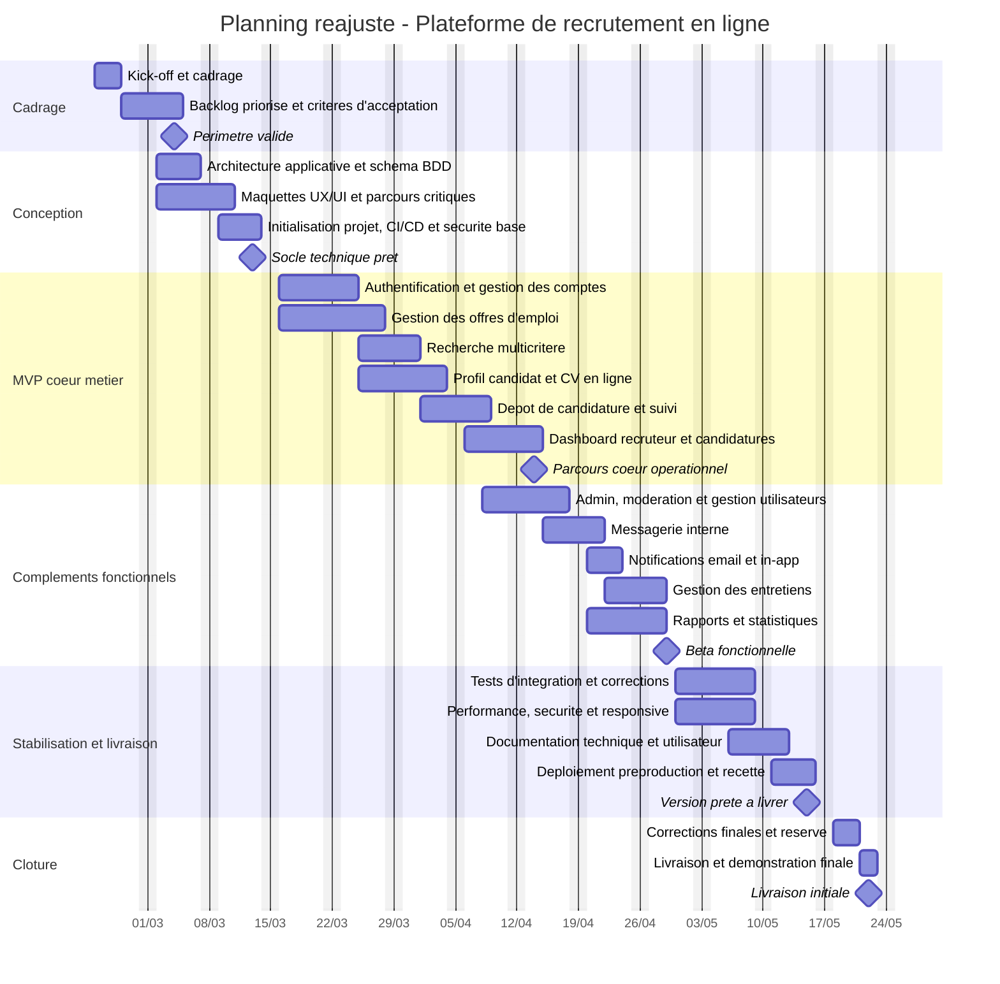

# Planning reajuste du projet - Plateforme de recrutement en ligne

## Hypotheses de planification

- Date de demarrage retenue pour le planning reajuste : 23 fevrier 2026
- Horizon de realisation : 13 semaines, jusqu'au 22 mai 2026
- Equipe type supposee : 1 chef de projet/analyste, 1 developpeur frontend, 1 developpeur backend, 1 profil QA/DevOps a temps partiel
- Organisation retenue : lots iteratifs avec chevauchement front, back et validation
- Les weekends sont exclus du calcul des durees
- Point d'avancement pris en compte : au 22 avril 2026, environ 2 mois sont passes et il reste 1 mois de projet

## Planning synthetique

| Phase | Tache | Debut | Fin | Duree estimee | Livrable / jalon |
| --- | --- | --- | --- | --- | --- |
| Cadrage | Kick-off et cadrage | 2026-02-23 | 2026-02-25 | 3 j | Vision projet partagee |
| Cadrage | Backlog priorise et criteres d'acceptation | 2026-02-26 | 2026-03-04 | 5 j | Perimetre priorise |
| Conception | Architecture applicative et schema BDD | 2026-03-02 | 2026-03-06 | 5 j | Architecture cible |
| Conception | Maquettes UX/UI et parcours critiques | 2026-03-02 | 2026-03-10 | 7 j | Parcours valides |
| Conception | Initialisation du projet, CI/CD et securite de base | 2026-03-09 | 2026-03-13 | 5 j | Socle technique pret |
| MVP coeur metier | Authentification et gestion des comptes | 2026-03-16 | 2026-03-24 | 7 j | Inscription / connexion |
| MVP coeur metier | Gestion des offres d'emploi | 2026-03-16 | 2026-03-27 | 10 j | CRUD offres |
| MVP coeur metier | Recherche multicritere | 2026-03-25 | 2026-03-31 | 5 j | Recherche filtree |
| MVP coeur metier | Profil candidat et CV en ligne | 2026-03-25 | 2026-04-03 | 8 j | Profil complet |
| MVP coeur metier | Depot de candidature et suivi des statuts | 2026-04-01 | 2026-04-08 | 6 j | Flux de candidature |
| MVP coeur metier | Dashboard recruteur et gestion des candidatures | 2026-04-06 | 2026-04-14 | 7 j | Parcours recruteur |
| Complements fonctionnels | Administration, moderation et gestion utilisateurs | 2026-04-08 | 2026-04-17 | 8 j | Back-office admin |
| Complements fonctionnels | Messagerie interne | 2026-04-15 | 2026-04-21 | 5 j | Echanges candidat/recruteur |
| Complements fonctionnels | Notifications email et in-app | 2026-04-20 | 2026-04-23 | 4 j | Alertes automatiques |
| Complements fonctionnels | Gestion des entretiens | 2026-04-22 | 2026-04-28 | 5 j | Planification entretiens |
| Complements fonctionnels | Rapports et statistiques | 2026-04-20 | 2026-04-29 | 7 j | Indicateurs globaux |
| Stabilisation | Tests d'integration et corrections | 2026-04-30 | 2026-05-08 | 7 j | Version beta stabilisee |
| Stabilisation | Performance, securite et responsive | 2026-04-30 | 2026-05-08 | 7 j | Conformite non fonctionnelle |
| Stabilisation | Documentation technique et utilisateur | 2026-05-06 | 2026-05-12 | 5 j | Dossier projet |
| Livraison | Deploiement preproduction et recette | 2026-05-11 | 2026-05-15 | 5 j | Version prete a livrer |
| Livraison | Corrections finales et reserve projet | 2026-05-18 | 2026-05-20 | 3 j | Ajustements finaux |
| Livraison | Livraison et demonstration finale | 2026-05-21 | 2026-05-22 | 2 j | Livraison initiale |

## Jalons principaux

| Jalon | Date | Signification |
| --- | --- | --- |
| M1 | 2026-03-04 | Perimetre fonctionnel valide |
| M2 | 2026-03-13 | Socle technique pret |
| M3 | 2026-04-14 | Parcours coeur candidat/recruteur operationnel |
| M4 | 2026-04-29 | Beta fonctionnelle complete |
| M5 | 2026-05-15 | Version prete a livrer |
| M6 | 2026-05-22 | Livraison initiale |

## Diagramme de GANTT

## Points de vigilance

- La tenue de ce planning suppose un travail en parallele sur le frontend et le backend.
- Les modules messagerie, notifications et email peuvent rallonger le projet si le choix du fournisseur intervient tard.
- Les exigences non fonctionnelles (performance, securite, responsive, compatibilite) doivent etre verifiees des le MVP et pas uniquement en fin de projet.
- Si le projet est mene par une seule personne, il faut prevoir un allongement du planning de 30 a 50 %.
